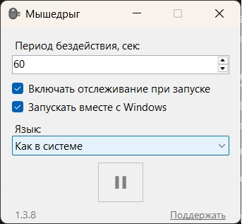
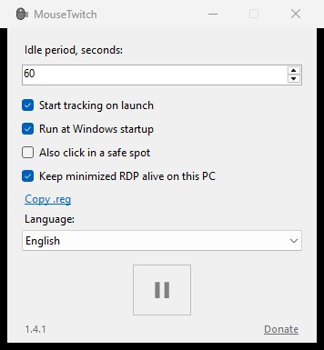
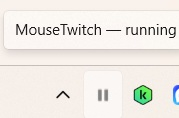

# Мышедрыг / MouseTwitch

Небольшая Windows-утилита: при бездействии мыши и клавиатуры делает короткое движение курсора, чтобы система не уходила в простой.

A small Windows tray app that nudges the mouse after idle time so the session stays active.

Keywords: эмулятор мыши, антисон, idle mouse, mouse jiggler, keep Windows awake.







---

# Русский

## Возможности

- Период бездействия задаётся в секундах
- Старт и стоп с формы и из трея
- Крестик сворачивает в трей; выход — из меню по ПКМ
- Автозапуск с Windows и автовключение отслеживания
- Русский и английский интерфейс
- Опциональный клик в безопасной точке (выключен по умолчанию; для RDP и жёстких политик простоя)
- Галочка «Не глушить свёрнутый RDP» на компьютере, с которого открываете Remote Desktop (не внутри терминала)

## Как пользоваться

1. Скачайте `MouseTwitch.exe` и запустите (установка не нужна).
2. Задайте период бездействия.
3. Нажмите треугольник (play), чтобы включить отслеживание. Две черты (pause) — выключить.
4. Закрытие окна прячет программу в трей. Полный выход: ПКМ по иконке → «Выход».

## Скачать

Windows 10/11, нужен [.NET Framework 4.8](https://dotnet.microsoft.com/download/dotnet-framework/net48) (обычно уже установлен).

Файл: [Releases](https://github.com/denis-fm/MouseTwitch-bin/releases/latest) → `MouseTwitch.exe`.

Исходный код в этом репозитории не публикуется.

### SHA256 (v1.4.1)

```
dd02e5ea54ca543a989c5ba1cc0d93b7f98fec65c48a1e784d42b7489ff2951a
```

Проверка в PowerShell:

```powershell
Get-FileHash .\MouseTwitch.exe -Algorithm SHA256
```

## Если Windows блокирует запуск

Файл не подписан сертификатом, SmartScreen может показать «Windows защитила ваш компьютер».

**Подробнее** → **Выполнить в любом случае**.

## Чего программа не делает

- Не обходит пароль блокировки и политики домена
- Не двигает мышь постоянно, только после заданного простоя
- Курсор смещается на десятки пикселей и возвращается назад
- Свёрнутое окно RDP глушит сеанс на сервере: галочку или .reg нужно включить на своём ПК, затем переподключиться

## Приватность

Нет телеметрии и скрытых запросов в сеть. Настройки хранятся локально в `%AppData%\MouseTwitch`. В браузер программа выходит только если нажать «Поддержать».

## Поддержать

[CloudTips](https://pay.cloudtips.ru/p/0e9863dd)

---

# English

## Features

- Idle timeout is set in seconds
- Start and stop from the window or the tray icon
- Closing the window hides it to the tray; quit from the tray context menu
- Optional run at Windows startup and start tracking on launch
- Russian and English UI
- Optional click in a safe spot (off by default; for RDP and strict idle policies)
- Option to keep a minimized RDP window from suppressing the remote session (set this on the PC you connect from)

## How to use

1. Download `MouseTwitch.exe` and run it (no installer).
2. Set the idle period.
3. Click the triangle (play) to start tracking. Click the pause bars to stop.
4. Closing the window hides the app to the tray. To quit: right-click the tray icon → Exit.

## Download

Windows 10/11, requires [.NET Framework 4.8](https://dotnet.microsoft.com/download/dotnet-framework/net48) (usually already installed).

Get the file from [Releases](https://github.com/denis-fm/MouseTwitch-bin/releases/latest) → `MouseTwitch.exe`.

Source code is not published in this repository.

### SHA256 (v1.4.1)

```
dd02e5ea54ca543a989c5ba1cc0d93b7f98fec65c48a1e784d42b7489ff2951a
```

Verify in PowerShell:

```powershell
Get-FileHash .\MouseTwitch.exe -Algorithm SHA256
```

## If Windows blocks the app

The executable is not code-signed. SmartScreen may show “Windows protected your PC”.

**More info** → **Run anyway**.

## What it does not do

- It does not bypass the lock screen password or domain policies
- It does not move the mouse continuously, only after the idle timeout
- The cursor moves by tens of pixels and then returns
- A minimized RDP window suppresses the remote desktop: enable the option or .reg on your local PC, then reconnect

## Privacy

No telemetry and no background network calls. Settings are stored locally in `%AppData%\MouseTwitch`. The app opens a browser only if you click Donate.

## Support

[CloudTips](https://pay.cloudtips.ru/p/0e9863dd)
